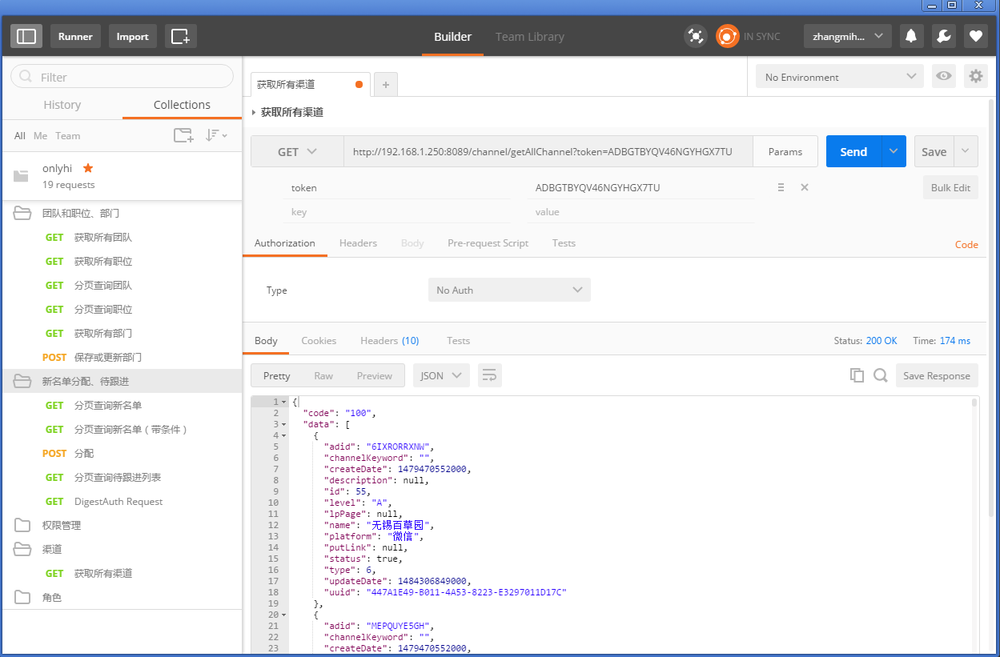
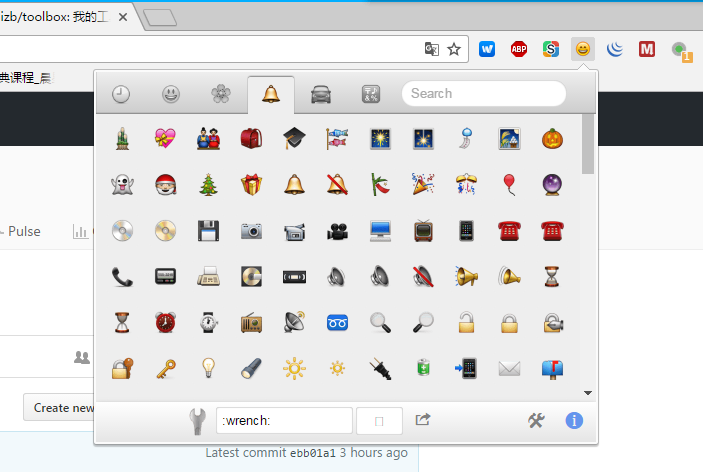
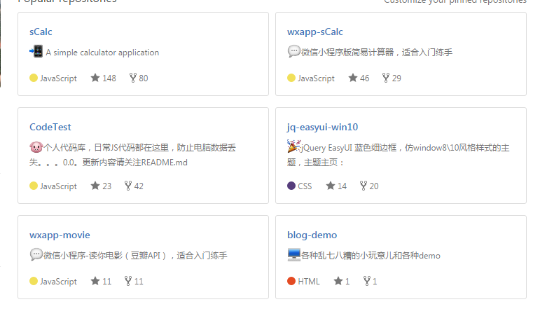
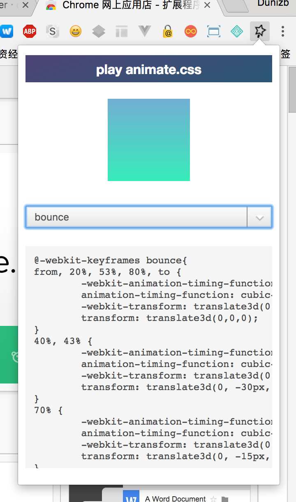

# toolbox
:wrench:我的工具大全

By [Dunizb](http://duni.sinaapp.com) (Follow Me: [微博](http://www.weibo.com/duni)、[SegmentFault](https://segmentfault.com/u/dunizb)、[简书](http://www.jianshu.com/u/737d8047278d))


## Chrome篇

### Postman

Postman是一款功能强大的网页调试与发送网页HTTP请求的Chrome插件。

[下载地址](https://chrome.google.com/webstore/detail/postman/fhbjgbiflinjbdggehcddcbncdddomop?utm_source=chrome-ntp-icon)

### Emoji Cheatsheet for GitHub

Emoji表情，提交代码的时候可以添加各种emoji表情了,在github文本框或git项目中加入emoji符号：

```
:wrench:我的工具大全
```



在github显示emoji表情：



[下载地址](https://chrome.google.com/webstore/detail/emoji-cheatsheet-for-gith/nojknakoailnpbjlmfkpbbhoodlolfbh)

### chrome-markdown
让你直接在浏览器中浏览Markdown文件内容
[下载地址](http://pan.baidu.com/s/1kVSGLgj)

### Wappalyzer
Wappalyzer 网站是一个可以分析不同网站所使用的各种技术的工具，对于有自身经验的网站开发者而言可以通过代码开分析网站的构架和所采用的技术，不过现在你可以通过工具来获得网站技术的参数报告了。


[网站](https://wappalyzer.com/?pk_campaign=chrome&pk_kwd=context)

### Vysor
https://chrome.google.com/webstore/detail/vysor/gidgenkbbabolejbgbpnhbimgjbffefm


实机调试 Android 应用，你是不是还在一边测试着 Android 设备一边在电脑上修改代码？有了 Vysor 这款 Chrome 插件，只需要通过 USB 连接，你就可以直接在 Chrome 中通过鼠标操作 Android 设备，设备间切换造成的时间成本降低了，开发效率自然就提高了。

### XX-Net
免费开源的翻墙利器
[XX-Net中文网站](https://github.com/XX-net/XX-Net/wiki/%E4%B8%AD%E6%96%87%E6%96%87%E6%A1%A3)


### animate-playerboxa
对于经常和动画开发打交道的开发者对于Animate.css这个动画库不会陌生，它把一些常见的动画效果都封装起来了，非常实用。但是有时候在开发中，仅仅只是需要某一两个动画效果，把整个CSS文件都引入，这样不是太好。animate-playerboxa就是这样一个工具，可以直接预览Animate.css对应的动画效果，并且生成对应的动画代码，从此不再需要把整个动画库都引入了。  
  
[下载地址](https://chrome.google.com/webstore/detail/animate-playerbox/lpjcokgibjaiedlkgjlkplfdppmehbeb)

### GitHub HTML Preview
Github HTML Preview将预览按钮添加到Github仓库， 使其更快更可靠地预览HTML网页，而无需拉取或克隆。  
  
[下载地址](https://chrome.google.com/webstore/detail/github-html-preview/lmihfkpdkklhaaiejfmfjfjnbdmbnick?utm_source=chrome-ntp-icon)


